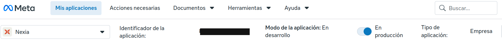
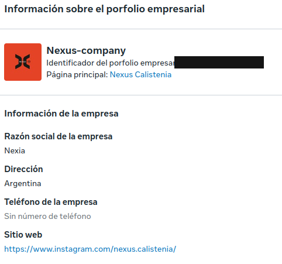
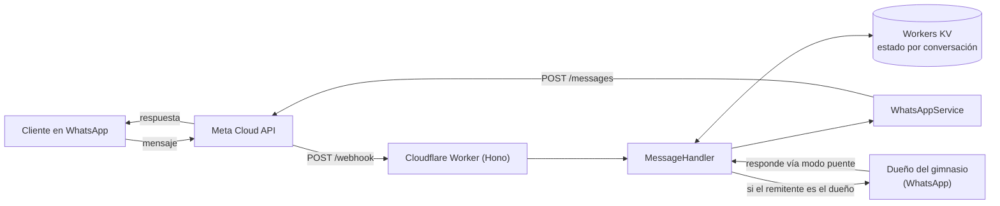
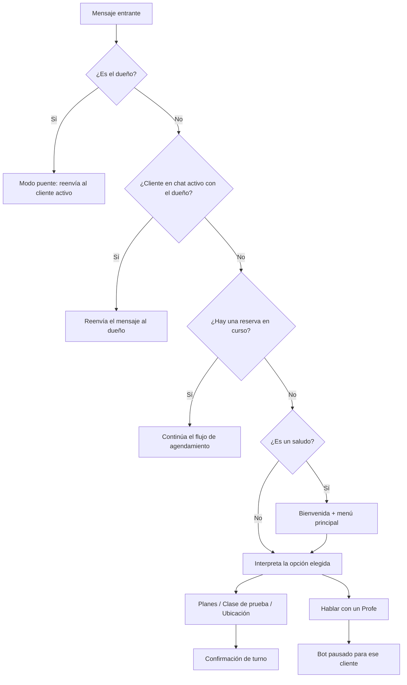
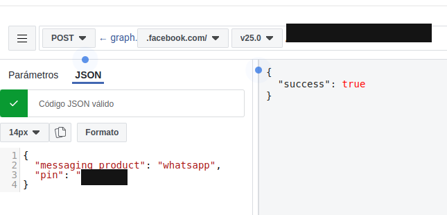

# Nexus Bot

> Asistente de WhatsApp para un gimnasio de calistenia: responde consultas, agenda clases de prueba y deriva la conversación a una persona cuando hace falta — corriendo en el edge de Cloudflare sobre la API oficial de Meta.


[](https://github.com/RodolGiaco/Nexus-bot-whatsApp/actions/workflows/deploy.yml)

## Índice

- [Descripción](#descripción)
- [Demo](#demo)
- [Características principales](#características-principales)
- [Stack tecnológico](#stack-tecnológico)
- [Arquitectura](#arquitectura)
- [Endpoints](#endpoints)
- [Estructura del proyecto](#estructura-del-proyecto)
- [Instalación y uso](#instalación-y-uso)
- [Decisiones técnicas](#decisiones-técnicas)
- [Autor y contacto](#autor-y-contacto)

## Descripción

Nexus Bot es la asistente virtual de WhatsApp de un gimnasio de calistenia real. Se presenta ante cada cliente como **"Nexia"**, entiende saludos y consultas simples, muestra los planes disponibles, agenda clases de prueba y — cuando el cliente necesita hablar con una persona — pausa el flujo automático y abre un puente de mensajes en vivo con el dueño del gimnasio, sin que el cliente note el cambio.

El proyecto existe porque atender WhatsApp a mano no escala: los mismos mensajes ("¿qué planes tienen?", "quiero probar una clase") se repiten todo el día, y un negocio chico no tiene margen para contratar a alguien solo para eso. El bot resuelve las consultas frecuentes al instante y libera al dueño para las conversaciones que sí necesitan a una persona.

Está construido sobre la **WhatsApp Cloud API oficial de Meta** (no un cliente no oficial), corre como **Cloudflare Worker** y hoy está desplegado y operando en modo producción — las capturas en la sección [Demo](#demo) son del panel real de Meta para esta aplicación.

## Demo

**Panel de la app en Meta, en modo producción:**



**Portfolio empresarial asociado en Meta Business:**



> 📸 *Espacio para agregar:* una captura o GIF de una conversación real de WhatsApp mostrando el saludo inicial → menú de opciones → agendamiento de una clase de prueba, y otra mostrando el momento en que la conversación pasa a un humano ("Hablar con un Profe").

## Características principales

- 👋 **Saludo y menú automático** — reconoce saludos y responde con un menú de opciones interactivo (botones nativos de WhatsApp).
- 🏋️ **Consulta de planes** — Grupal, Particular u Online, con su propio submenú.
- 🎟️ **Agendamiento de clase de prueba** — flujo guiado de varios pasos, con el estado de cada conversación persistido entre mensajes.
- 🙋 **Traspaso a chat humano (modo puente)** — un cliente puede pedir hablar con el dueño; a partir de ahí sus mensajes se reenvían en vivo y las respuestas del dueño vuelven al cliente, sin que el bot intervenga.
- 📍 **Envío de ubicación** — sede grupal o particular, según lo que pida el cliente.
- 📇 **Tarjeta de contacto** y **confirmación de lectura** de cada mensaje entrante.
- 🔒 **Verificación de webhook** siguiendo el estándar de Meta (`hub.mode` / `hub.verify_token` / `hub.challenge`).

## Stack tecnológico

| Tecnología | Versión | Uso |
|---|---|---|
| [Cloudflare Workers](https://workers.cloudflare.com/) | — | Runtime de edge donde corre el bot en producción |
| [Hono](https://hono.dev/) | ^4.13.2 | Framework HTTP del Worker |
| [Workers KV](https://developers.cloudflare.com/kv/) | — | Persistencia del estado de cada conversación entre requests |
| [WhatsApp Cloud API](https://developers.facebook.com/docs/whatsapp/cloud-api) | v22.0 | Mensajería, botones interactivos y webhooks vía Graph API de Meta |
| [Express](https://expressjs.com/) | ^4.22.1 | Framework HTTP de la variante Node.js del bot (uso local) |
| [Axios](https://axios-http.com/) | ^1.13.6 | Cliente HTTP hacia la Graph API en la variante Express |
| [dotenv](https://github.com/motdotla/dotenv) | ^16.6.1 | Carga de variables de entorno en la variante Express |
| Node.js (ESM) | ≥18 | Runtime de la variante Express y de las herramientas de desarrollo |
| [Wrangler](https://developers.cloudflare.com/workers/wrangler/) | — | CLI de Cloudflare para desarrollo local y despliegue del Worker |
| [nodemon](https://nodemon.io/) | ^3.1.14 | Recarga automática durante el desarrollo de la variante Express |

## Arquitectura

El bot tiene dos formas de correr, con la misma lógica de negocio: como **Worker de Cloudflare** (la que está en producción) o como **servidor Express** (para desarrollo local sin depender de Cloudflare). El siguiente diagrama muestra el camino de un mensaje en la variante Worker:



Y este muestra cómo decide qué hacer con cada mensaje entrante:



## Endpoints

El bot expone la misma superficie HTTP en las dos variantes (`worker/` y `src/`):

| Método | Ruta | Descripción | Parámetros / Body |
|---|---|---|---|
| `GET` | `/webhook` | Verificación del webhook exigida por Meta al configurarlo o reconfirmarlo. | Query: `hub.mode`, `hub.verify_token`, `hub.challenge` |
| `POST` | `/webhook` | Recibe los mensajes y eventos entrantes de WhatsApp (texto, botones, contactos). | Body: payload estándar de Meta (`entry[].changes[].value.messages[]`) |
| `GET` | `/` | Página de estado; confirma que el servicio está corriendo. | — |

## Estructura del proyecto

```text
nexus-bot/
├── .github/
│   └── workflows/
│       └── deploy.yml             # CI/CD: despliega worker/ a Cloudflare en cada push a main
├── worker/                        # Implementación desplegada (Cloudflare Worker)
│   ├── index.js                   #   Entry point: registra las rutas del Worker
│   ├── controllers/
│   │   └── webhookController.js   #   Verifica el webhook y recibe los mensajes
│   ├── routes/
│   │   └── webhookRoutes.js       #   Define GET/POST /webhook
│   └── services/
│       ├── messageHandler.js      #   Lógica conversacional (menús, agenda, puente)
│       ├── whatsappService.js     #   Envío de mensajes vía fetch nativo
│       └── state.js               #   Persistencia del estado en Workers KV
├── src/                           # Implementación Express (uso local / alternativo)
│   ├── app.js                     #   Entry point del servidor Express
│   ├── config/
│   │   └── env.js                 #   Carga y expone las variables de entorno
│   ├── controllers/
│   │   └── webhookController.js
│   ├── routes/
│   │   └── webhookRoutes.js
│   └── services/
│       ├── messageHandler.js      #   Misma lógica conversacional que worker/
│       ├── whatsappService.js     #   API de alto nivel (texto, botones, ubicación, etc.)
│       └── httpRequest/
│           └── sendToWhatsApp.js  #   Cliente HTTP hacia la Graph API (axios)
├── docs/
│   └── assets/                    # Capturas usadas en este README
├── wrangler.toml                  # Configuración de despliegue del Worker (Cloudflare)
├── nodemon.json                   # Config de recarga automática para la variante Express
├── .env.example                   # Variables de entorno necesarias para src/ (sin valores reales)
├── .dev.vars.example              # Variables necesarias para worker/ en local (sin valores reales)
└── LICENSE
```

## Instalación y uso

### Requisitos previos

- [Node.js](https://nodejs.org/) 18 o superior y npm.
- Una app en [Meta for Developers](https://developers.facebook.com/) con el producto **WhatsApp** agregado, y un número de prueba o de producción vinculado.
- Una cuenta de [Cloudflare](https://dash.cloudflare.com/) (solo si vas a correr/desplegar la variante Worker).
- Una URL pública HTTPS para recibir el webhook durante el desarrollo local (por ejemplo [ngrok](https://ngrok.com/) o `cloudflared tunnel`).

### 1. Clonar e instalar dependencias

```bash
git clone https://github.com/RodolGiaco/Nexus-bot-whatsApp.git
cd Nexus-bot-whatsApp
npm install
```

### 2. Configurar variables de entorno

Elegí la variante que vas a correr y copiá su archivo de ejemplo:

```bash
# Para la variante Worker (Cloudflare)
cp .dev.vars.example .dev.vars

# Para la variante Express (Node.js)
cp .env.example .env
```

Completá los valores reales en el archivo copiado: el token de acceso de la WhatsApp Cloud API, el verify token del webhook, y el resto de los datos de tu número de WhatsApp Business. Ninguno de los dos archivos se sube al repositorio (están en `.gitignore`).

### 3. Registrar el número en la Cloud API (paso obligatorio)

Vincular el número en el App Dashboard no alcanza: para que la Cloud API pueda enviar y recibir mensajes con ese número hace falta registrarlo explícitamente con una llamada a la Graph API. Si se omite este paso, el número figura configurado pero cualquier envío falla — es el paso que más fácil se pasa por alto al conectar un número nuevo.

```bash
curl -X POST "https://graph.facebook.com/v22.0/<BUSINESS_PHONE>/register" \
  -H "Authorization: Bearer <API_TOKEN>" \
  -H "Content-Type: application/json" \
  -d '{
    "messaging_product": "whatsapp",
    "pin": "123456"
  }'
```

`pin` es un PIN de 6 dígitos elegido por vos (verificación en dos pasos del número), necesario también si el número se vuelve a registrar más adelante — por ejemplo, tras migrarlo desde la app de WhatsApp Business. Una respuesta `{"success": true}` confirma el registro; así se ve en la práctica, contra la app real de este proyecto:



Se hace una sola vez por número, no en cada deploy.

### 4a. Correr la variante Worker (Cloudflare) en local

```bash
npx wrangler kv namespace create BOT_STATE   # solo la primera vez
npx wrangler dev
```

### 4b. Correr la variante Express (Node.js) en local

```bash
npm run dev     # con recarga automática (nodemon)
# o
npm start
```

### 5. Exponer el servidor y configurar el webhook en Meta

Con el servidor corriendo en local, abrí un túnel público (`ngrok http 3000` o `cloudflared tunnel --url http://localhost:8787`, según la variante) y cargá esa URL + tu verify token en **Meta App Dashboard → tu app → WhatsApp → Configuration → Webhooks**.

### 6. Desplegar a producción (variante Worker)

Los secrets del Worker se cargan una sola vez (persisten en Cloudflare entre deploys):

```bash
npx wrangler secret put WEBHOOK_VERIFY_TOKEN
npx wrangler secret put API_TOKEN
```

A partir de ahí, el deploy es automático: **cada push a `main` que toca `worker/`, `wrangler.toml` o las dependencias dispara [`.github/workflows/deploy.yml`](.github/workflows/deploy.yml)**, que corre `wrangler deploy` en GitHub Actions. También se puede disparar a mano desde la pestaña *Actions* del repositorio (`workflow_dispatch`).

Para que el workflow funcione hace falta cargar dos secrets en **GitHub → Settings → Secrets and variables → Actions**:

| Secret | De dónde sale |
|---|---|
| `CLOUDFLARE_API_TOKEN` | Cloudflare Dashboard → My Profile → API Tokens → *Create Token* con permiso "Edit Cloudflare Workers" |
| `CLOUDFLARE_ACCOUNT_ID` | Cloudflare Dashboard → cualquier zona → columna derecha, "Account ID" |

Sin un deploy manual con `wrangler deploy` o sin cargar esos dos secrets, un push a `main` no llega a producción.

## Decisiones técnicas

**Cloudflare Workers + Hono como runtime principal.** Un bot de un solo negocio recibe tráfico intermitente: no tiene sentido pagar por un servidor prendido 24/7. Los Workers escalan a cero, no tienen que administrarse, y el cold start es prácticamente inexistente frente a una función serverless tradicional.

**Workers KV para el estado de la conversación.** Un Worker no garantiza que dos mensajes seguidos del mismo cliente caigan en la misma instancia — a diferencia de un proceso Node de larga duración, no hay memoria compartida entre requests. KV es la forma nativa de Cloudflare de persistir ese estado (en qué paso de la reserva está cada cliente, quién tiene el chat en modo puente) sin sumar una base de datos externa.

**`fetch` nativo en vez de axios en el Worker.** El runtime de Workers expone la Fetch API estándar; agregar axios ahí sería una dependencia de más. Por eso axios solo aparece como dependencia de la variante Express, que sí corre sobre Node.js.

**GitHub Actions para el deploy, en vez de la integración nativa de Cloudflare.** Cloudflare puede conectarse directo a un repo de GitHub y desplegar sin ningún archivo en el repositorio, pero ese pipeline queda solo en el dashboard de Cloudflare. Con un workflow versionado en `.github/workflows/` el proceso de deploy queda explícito, auditable y modificable como cualquier otro archivo del proyecto — y el filtro por `paths` evita redeploys en cambios que no tocan el Worker (como este mismo README).

**Dos formas de correr el mismo bot.** La lógica conversacional (`messageHandler.js`) está escrita dos veces a propósito: una vez sobre Hono/Workers/KV para producción, y otra sobre Express/Node para poder levantar el bot en cualquier entorno sin depender de Cloudflare, útil para probar cambios rápido en local.

**WhatsApp Cloud API oficial, no una librería no oficial.** Es un requisito de fondo para un bot que atiende clientes reales de un negocio: soporte y estabilidad garantizados por Meta, y es la única vía habilitada para un número de WhatsApp Business en modo producción.

## Autor y contacto

**Rodolfo Giacomodonatto**

- GitHub: [@RodolGiaco](https://github.com/RodolGiaco)
- LinkedIn: _agregar enlace_
- Email: rodol.giacomodonatto@gmail.com
